# **流媒体争霸：Netflix vs Disney+ vs 其他 —— 交互式可视化说明文档**

## **1\. 项目概述**

### **1.1 选题背景**

随着流媒体平台（Netflix、Disney+、Amazon Prime）的竞争日益激烈，内容库的构成、口碑表现及全球扩张策略成为了行业关注的焦点。本作品旨在通过交互式可视化手段，挖掘各大平台在海量数据背后的差异化竞争策略，帮助用户直观理解不同平台的定位与优势。

### **1.2 核心研究问题**

* **增长态势**：不同流媒体平台的内容库增长趋势有何异同？  
* **口碑对比**：哪个平台的整体评分表现更优？  
* **多维关联**：评分、时长、上映年份之间是否存在潜在关联？  
* **近期趋势**：近五年各平台的内容扩张趋势怎样？  
* **内容偏好**：各平台在内容类型（动作、喜剧、纪录片等）上的侧重点有何不同？  
* **地理分布**：内容的产地分布具有怎样的空间规律？

### **1.3 最终作品链接**

* **GitHub Pages**: [https://Laughter-cx.github.io/streaming-visualization](https://Laughter-cx.github.io/streaming-visualization)  
* **演示视频**: [https://www.bilibili.com/video/BV1fc5j62E7a/?share_source=copy_web&vd_source=009ab5836cedd7bf287723ef64a8cc78](https://www.bilibili.com/video/BV1fc5j62E7a/?share_source=copy_web&vd_source=009ab5836cedd7bf287723ef64a8cc78)

## **2\. 数据来源与处理**

### **2.1 原始数据**

* **Netflix 数据集**: Kaggle \- Netflix Movies and TV Shows (约 8,000 条)  
* **Disney+ 数据集**: Kaggle \- Disney+ Movies and TV Shows (约 1,500 条)  
* **Amazon Prime 数据集**: Kaggle \- Amazon Prime Movies and TV Shows (约 10,000 条)

### **2.2 数据清洗与整合**

统一三个数据集的列名（title, platform, type, release_year, rating, duration, country, listed_in, description）
处理缺失值：缺失的国家填 Unknown，缺失的评分填 N/A，缺失的描述填 No description
提取时长中的分钟数（仅对电影有效）
合并三个数据集，输出 streaming_data.json（共 19,925 条）
计算各平台各类型占比，输出 type_ratio.json（用于雷达图）
为前端开发提供 200 条样本数据 sample.json

## **3\. 设计决策与替代方案**

### 3.1 为什么选择堆叠条形图 + 年份滑块？

* **决策**：展示各平台每年新增内容数量的变化趋势，并用滑块让用户选择时间范围。
* **理由**：堆叠条形图能直观对比多个平台在同一时间维度上的总量和构成，年份滑块提供交互式时间窗口过滤。
* **替代方案**：曾考虑过折线图（更强调趋势），但堆叠条形图在展示“每年总量+平台贡献”上更清晰，且与滑块配合更适合用户逐步探索。

### 3.2 为什么选择平行坐标图？

* **决策**：用平行坐标图展示评分、时长、上映年份、类型编码之间的多维关系，并支持 brush（框选）交互。
* **理由**：平行坐标图非常适合探索多个数值维度之间的相关性（如高评分是否与特定时长或年份相关），并支持刷选范围过滤。
* **替代方案**：散点图矩阵只能展示两两关系，无法同时处理4个以上维度；热力图无法表达个体影片的分布。

### 3.3 为什么选择世界地图 + 气泡？

* **决策**：用气泡图叠加在世界地图上，表示各国家/地区的内容数量。
* **理由**：地理分布是内容策略的重要维度，气泡大小直观反映数量差异，悬停显示详情。
* **替代方案**：choropleth（填色地图）会因国家面积大小误导用户（如俄罗斯面积大但内容可能不多），气泡图更准确。
* **地图瓦片选择**：最初使用 OpenStreetMap 瓦片服务，在国内网络下无法访问，最终替换为高德地图瓦片服务。

### 3.4 为什么选择雷达图（饼图）？

* **决策**：用雷达图（实际实现为饼图）比较不同平台在“动作/喜剧/剧情/纪录片”等类型上的占比。
* **理由**：雷达图适合展示多个类别的比例分布，易于发现平台的类型侧重。因实现复杂度，最终采用饼图，效果同样清晰。
* **替代方案**：分组柱状图也能比较，但饼图更紧凑。

### 3.5 交互技术选择

* **决策**：使用 D3.js 处理地图和平行坐标图，原生 JavaScript 管理全局状态和联动，Vega-Lite 或原生 D3 实现堆叠柱状图和饼图。
* **理由**：D3 灵活强大，可定制复杂图表；原生 JS 提供响应式数据流，简化联动逻辑。
* **替代方案**：纯 D3 实现所有图表会增加代码量和调试难度，纯 Vega-Lite 难以实现自定义地图和复杂 brush 交互。

## **4交互功能说明**

| 视图 | 图表类型 | 交互功能 | 回答的问题 |
| :------ | :---------- | :---------- | :------------- |
| 主视图1 | 堆叠条形图 + 年份滑块 | 点击柱子、拖动滑块 | 各平台内容库增长趋势 |
| 主视图2 | 平行坐标图 | brush（框选）& 悬停显示详情 | 评分、时长、年份之间的多维关系 |
| 主视图3 | 世界地图（气泡叠加） | 点击气泡、悬停显示详情 | 各平台内容的地域分布差异 |
| 辅助视图 | 饼图（原设计为雷达图） | 点击平台扇形 | 比较不同平台在各类内容上的占比 |

## **5\. 开发流程与成员分工**

### **5.1 迭代历程**

1. **v1.0 (第1周)**：完成数据清洗，搭建 D3.js 基础框架，初步实现堆叠柱状图。  
2. **v2.0 (第2周)**：引入全局状态管理，实现多图双向联动；优化地图渲染逻辑，引入气泡层。  
3. **v3.0 (第3周)**：完成 UI 视觉微调，修复地图瓦片加载与工具提示 Bug，录制演示视频。

### **5.2 成员分工与工时统计**

| 成员 | 主要职责 | 详细贡献 | 投入工时 |
| :---- | :---- | :---- | :---- |
| **崔晨曦(组长)** | 项目协调与集成 | 数据清洗、全局架构设计、文档定稿、测试与部署。 | 约 22h |
| **黄奕晨** | 核心视图开发 | 堆叠条形图、平行坐标图开发，实现 Brush 联动及性能优化。 | 约 28h |
| **李雪丽** | 地图与 UI 细节 | 世界地图（气泡映射）、饼图开发，修复提示框及地图联动 Bug。 | 约 26h |
| **胡贸曦** | 视觉设计与演示 | HTML/CSS 布局美化、响应式适配、90秒演示视频剪辑。 | 约 18h |

**总计工时**：约 94 小时

### **5.3 三次迭代记录**

| 迭代版本 | 时间 | 新增/改进内容 | 负责人 |
| :---------- | :------ | :---------------- | :-------- |
| v1.0（基础版） | 第1周 | 数据清洗完成；堆叠柱状图和平行坐标图框架搭建；地图使用 OpenStreetMap（底图无法加载）；无联动功能 | 全员 |
| v2.0（加入联动） | 第2周初 | 实现 updateAllCharts 全局联动框架；柱状图、饼图、地图之间的点击联动；平行坐标图 brush 功能完成 | B |
| v3.0（修复地图） | 第2周末 | 地图底图从 OpenStreetMap 替换为高德地图瓦片服务；修复地图底图超时问题；完善工具提示样式 | C |

### **5.4 组长测试日志（迭代验证）**

## V1.0

* **5月4日**

**测试内容**：数据加载、页面显示

**发现问题**：地图底图超时；平行坐标图无 brush；无联动

**状态**：未通过

**反馈对象**：黄奕晨 李雪丽

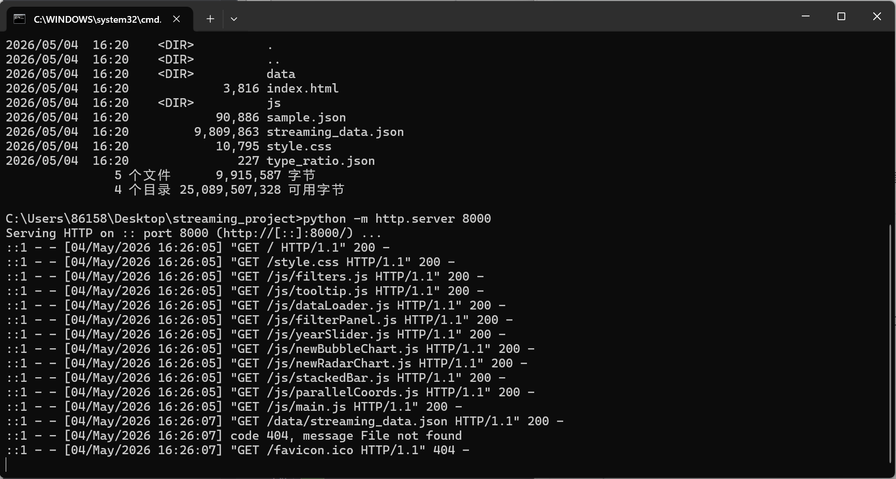

图1-1 启动成功

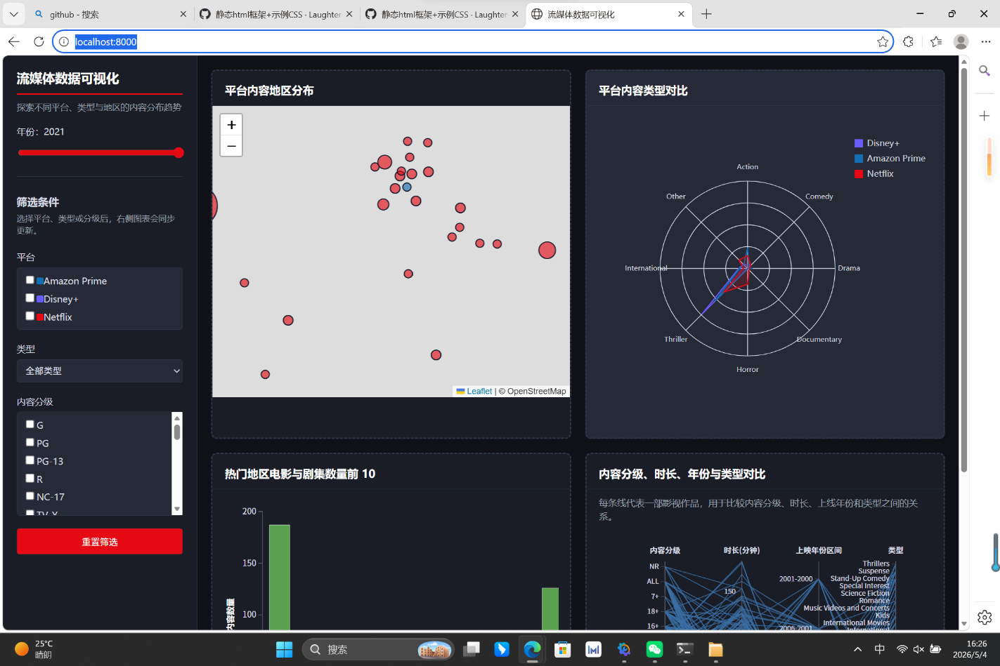

图1-2 系统实览

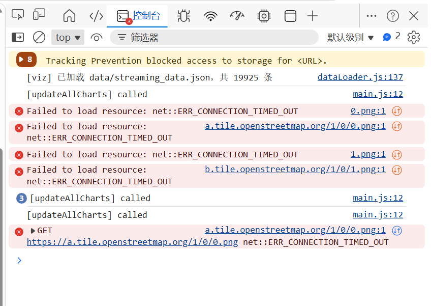

图1-3 console问题

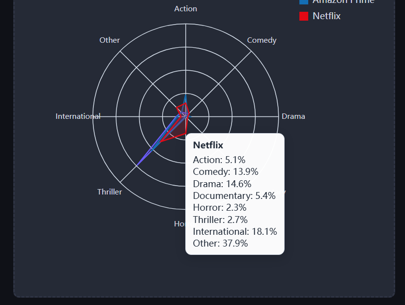

图1-4 悬停提示正常

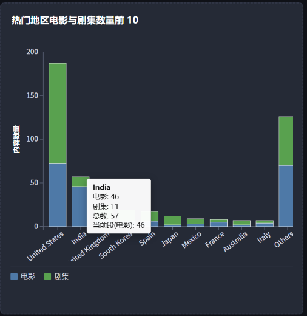

图1-5 悬停提示正常

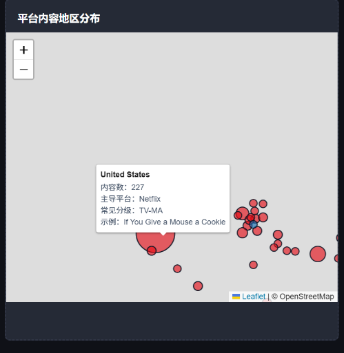

图1-6 悬停提示正常

## V2.0

* **5月6日**

**测试内容**：联动功能、brush

**发现问题**：brush 可框选且联动正常；地图底图仍超时

**状态**：部分通过

**反馈对象**：李雪丽（需换瓦片）

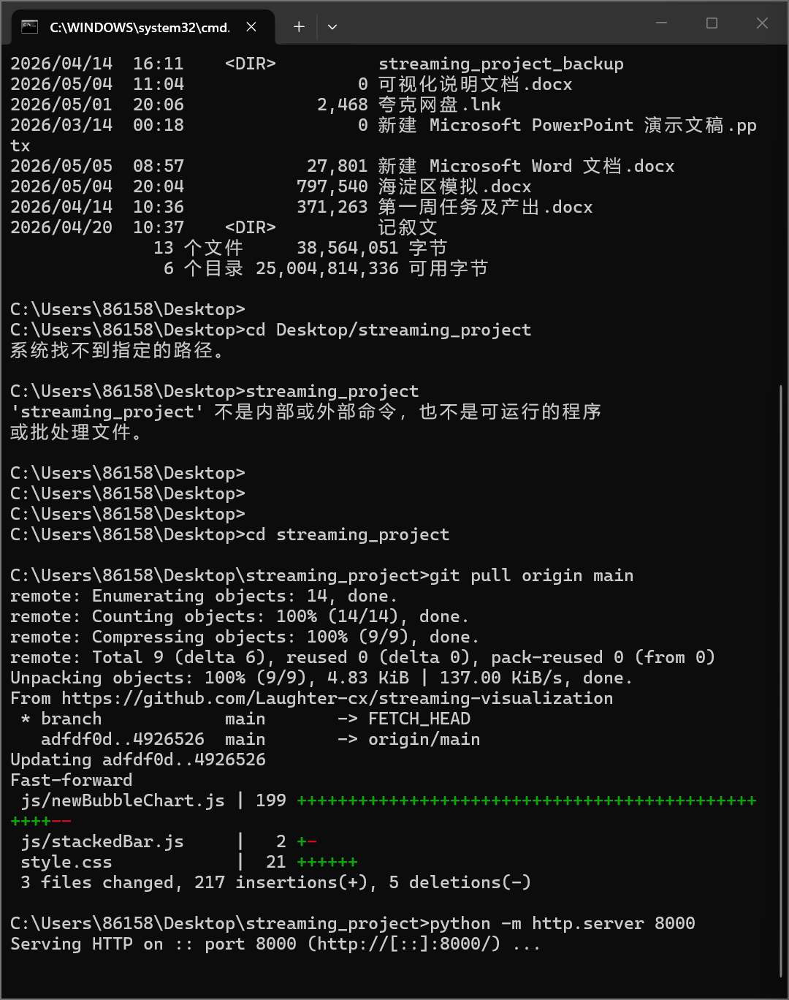

图2-1 启动成功

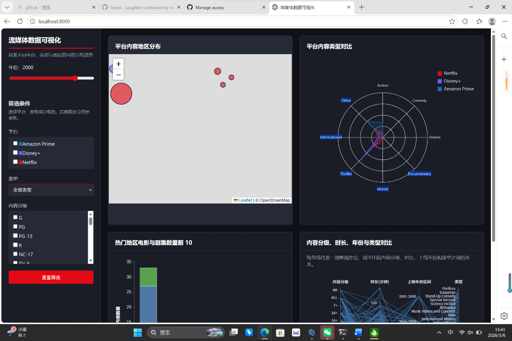

图2-2 系统实览

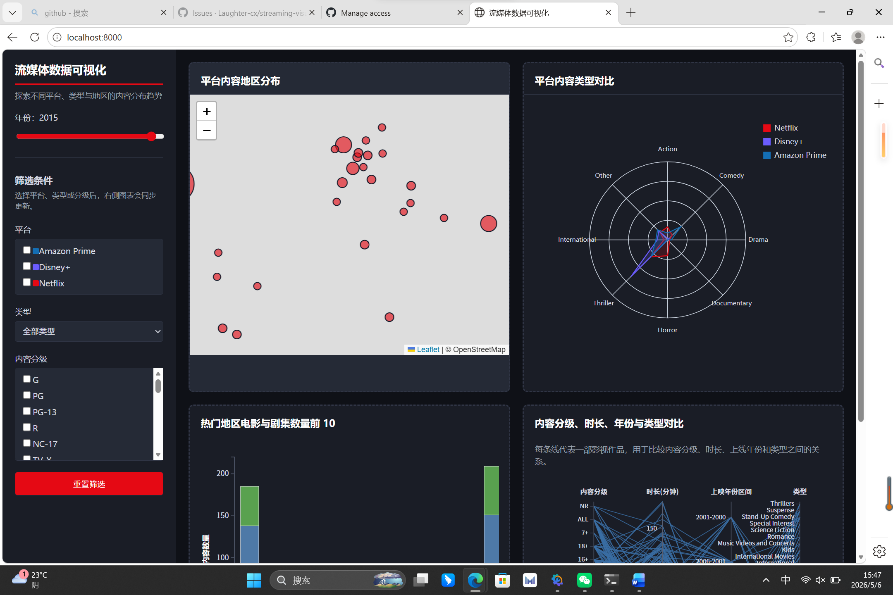

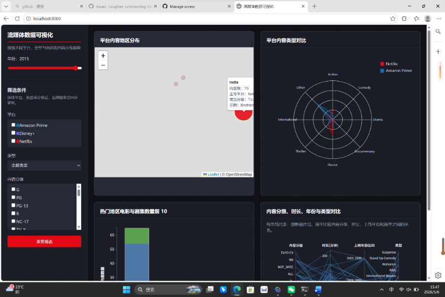

图2-3 气泡联动

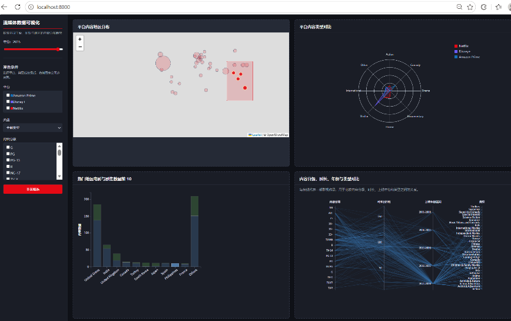

图2-4 brush拖动

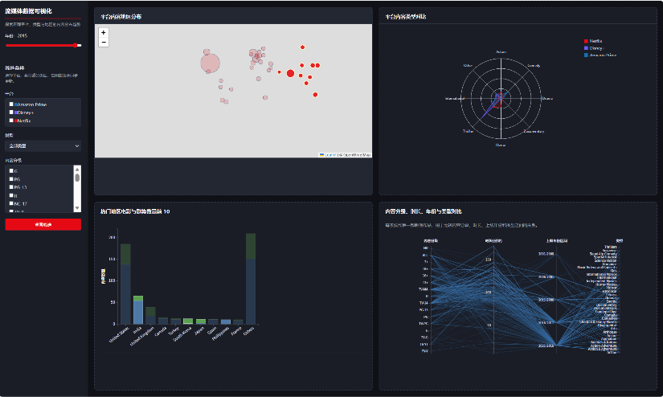

图2-5 brush拖动

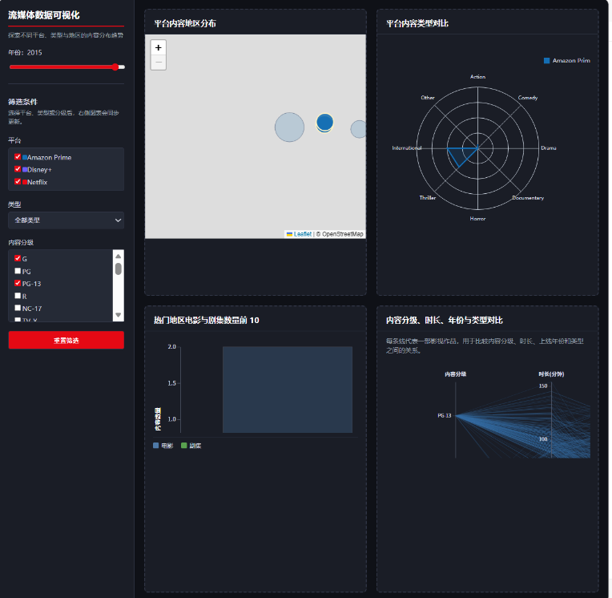

图2-6 响应式

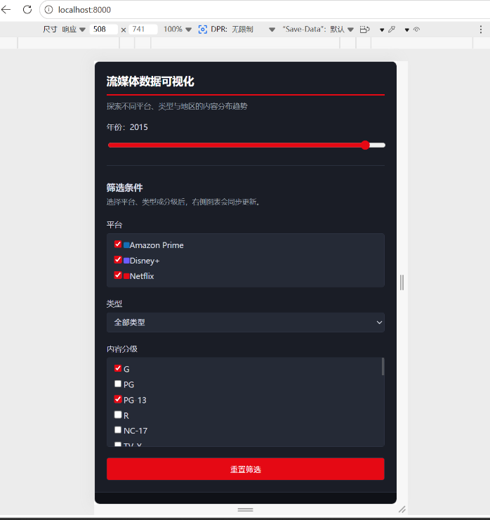

图2-7 响应式

## V3.0

**5月8日**

**测试内容**：地图底图修复、全部功能回归测试

**发现问题**：地图底图正常（高德瓦片 200）；Console 无红色错误；所有联动正常；响应式布局正常

**状态**：全部通过

**反馈对象**：无

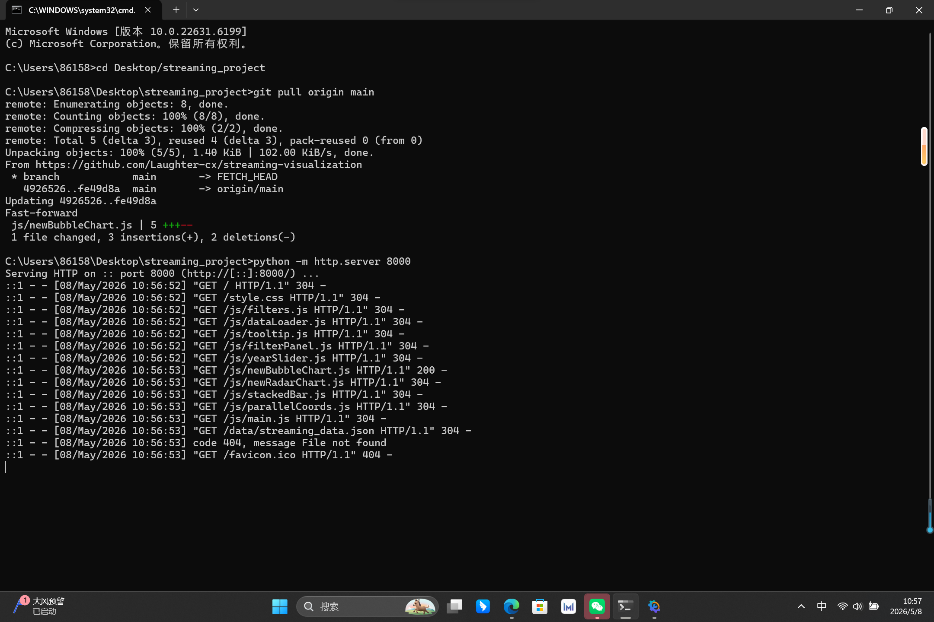

图3-1 启动成功

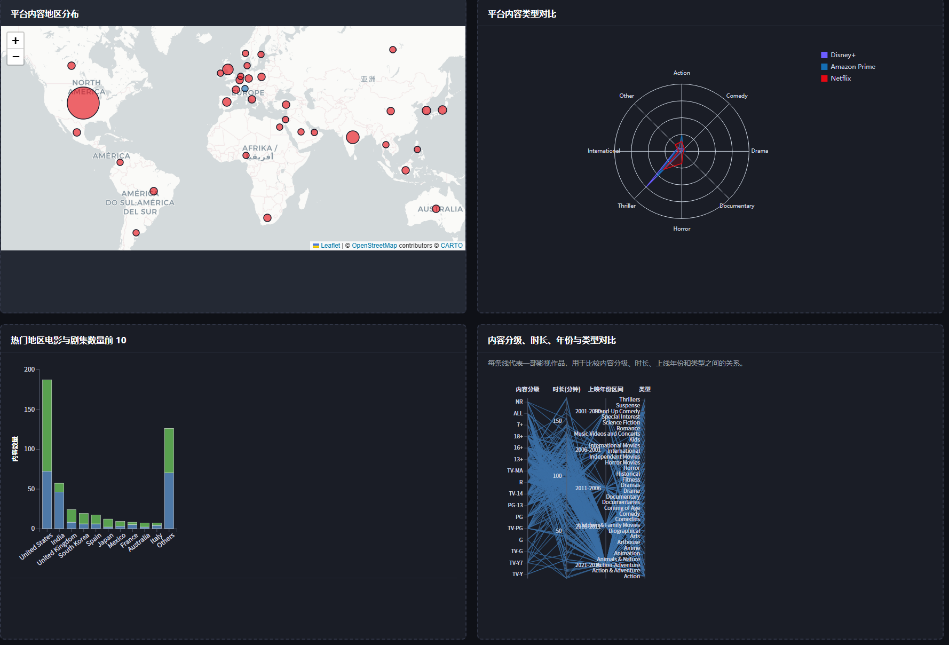

图3-2 系统实览

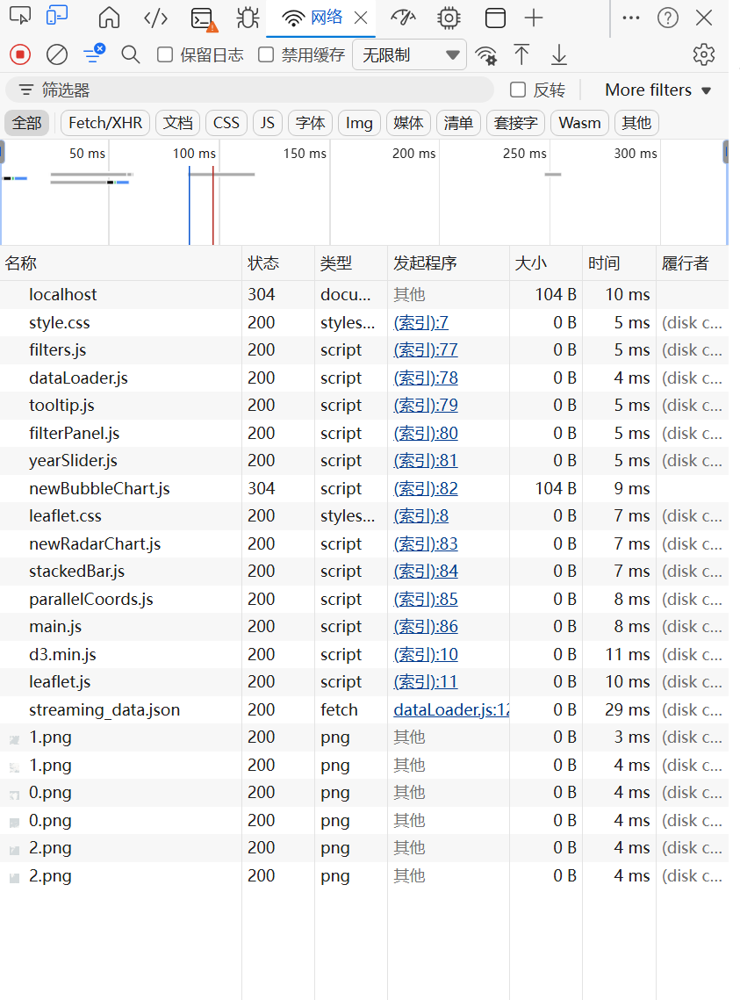

图3-3 console和network无误

## 最终测试确认项

* 数据加载成功（19,925 条）
* 堆叠柱状图显示正常，年份滑块可拖动
* 平行坐标图 brush 出现矩形框，松开后其他图表联动
* 地图底图显示街道/国家边界（高德瓦片）
* 地图气泡点击联动正常
* 地图悬停工具提示正常
* 饼图点击联动正常
* 柱状图点击联动正常
* 响应式布局（窗口拖窄无重叠，可滑动）
* Console 无红色错误，Network 无 4xx/5xx

## **6\. 外部资源引用**

* **可视化库**：D3.js (v7), Leaflet.js (地图底图)  
* **前端框架**：Tailwind CSS (样式管理)  
* **数据来源**：Kaggle Open Datasets  
* **字体/图标**：Font Awesome，字体使用系统默认，无外部字体引用
* **世界地图底图**：：[https://lbs.amap.com/](https://lbs.amap.com/)
  
*本报告由团队成员协作完成，旨在展示流媒体数据可视化的完整生命周期。*
